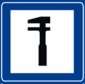

# L'Editor RDBK

Come funziona la sezione **Editor** di RDBK: il centro di creazione e modifica dei
roadbook. Documento di riferimento per il flusso, i tool sulla mappa e il modello di
editing delle note.

> L'Editor è una IIFE in [editor.js](../public/editor/editor.js) con la sua UI in
> [index.html](../public/editor/index.html). Tutto il lavoro pesante (geo-math, parsing,
> `buildRoadbook`, render della vignette, mappa, recording) è delegato alle primitive
> condivise `RB.*` / `NoteCanvas` / `RBMap` / `RBGpxRecorder` — vedi i rispettivi doc; qui
> documentiamo solo l'orchestrazione dell'Editor.

---

## 1. Scopo e struttura della pagina

L'Editor produce **un unico roadbook in memoria** (`rb`) con la forma del formato `.rdbk`
(`meta` · `track` · `notes` · `icons`) e lo edita finché non viene esportato o salvato.
Invariante chiave del codice: **qualunque siano i pezzi di origine, la rotta è sempre UNA
traccia continua** (commento di testa, [editor.js:7](../public/editor/editor.js#L7)).

La pagina ha due viste, commutate da `showView(v)`
([editor.js:427](../public/editor/editor.js#L427)):

| Vista        | Elemento      | Contenuto                                                        |
|--------------|---------------|-----------------------------------------------------------------|
| **map**      | `#viewMap`    | landing iniziale · mappa + barra strumenti · lista note + editor inline |
| **config**   | `#viewConfig` | dettagli roadbook (visibilità, descrizione, autore, org, logo, accesso mappa) + galleria foto |

Lo stato globale del modulo vive in poche variabili: `rb` (il roadbook), `sel` (indice nota
selezionata), `dirty`/`exported` (per il pulsante Save e il prompt di uscita), `editorOpen`
(editor nota aperto inline), più `gaps` (i tagli aperti, §3) e l'identità lato profilo
`currentRbId` + `status` (draft/ready/public) + `reusable` (§6).

---

## 2. Le sorgenti di creazione

La landing (`#loadFrom`) offre quattro carte; le altre due sorgenti (record/trip) arrivano
dal flusso di startup (§7). Tutte passano per `setRoadbook(r)`, che normalizza con
`RB.importRoadbook`, **pre-carica e rinfresca in modo asincrono** le icone della palette
standard usate (via `RB.urlToDataURL`): la UI renderizza subito e si ridisegna quando le icone
arrivano; l'arte aggiornata di un segnale sostituisce una copia vecchia embeddata in un
roadbook datato, mentre un'icona custom (fetch fallito) mantiene la sua (#174).

| Sorgente            | Handler | Cosa fa |
|---------------------|---------|---------|
| **GPX** (`+ .wpt`)  | `$('gpxFile').onchange` | `RB.parseGPX` (+ `RB.parseWPT` se manca) → `RB.buildRoadbook` |
| **Draw on the map** | `$('drawRoute').onclick` | apre la mappa in modalità `draw`; i primi due tap creano il roadbook |
| **.rdbk**           | `$('jsonFile').onchange` | `JSON.parse`, valida `track`+`notes`, `setRoadbook` — dettaglio e fedeltà per il Ranking in **§9** |
| **Roadbook pubblico** | `$('pickChallenge').onclick` | `RBChallenges.pick(…, { reusable: true })` → fork come **nuovo** roadbook (solo i pubblici riusabili, #106) |

Le sorgenti che importano contenuto *fresco* (GPX, .rdbk, pubblico) chiamano prima
`resetIdentity()`: azzera `currentRbId`, rimette lo stato a `draft` + `reusable` a false, e
ripulisce `?rb=` dall'URL — così importare qualcosa mentre si edita un roadbook salvato fa
partire una nuova entità, non sovrascrive l'originale.

---

## 3. La barra strumenti: il GPX si edita sulla mappa

La traccia non si edita in un editor a parte: si edita **direttamente sulla mappa** tramite
la barra verticale `.map-tools` ([index.html](../public/editor/index.html)). I tool
si dividono in **mode tool** (toggle esclusivi) e **one-shot** (azioni immediate).

> Caricata una rotta, il tool attivo di **default** è **Move** (`setMapTool('points')` in
> `setRoadbook`): si trascina qualunque punto — traccia **o** nota — e la linea segue (#61).
> La barra mostra **solo** ☰ · Undo · Redo; l'unico *mode tool* con un pulsante è **Cut**
> (`MODE_TOOLS = ['toolCut']`). Il menu **☰** (`#mapMenuPanel`) contiene **Cut · Add GPX ·
> Simplify · Adjust**. Non esiste un pulsante Move: **Esc** (o il completamento di un taglio)
> riporta a Move. **Draw** si avvia dalla landing (`drawRoute`) ed è il default per un roadbook
> senza rotta. **Reverse** è nei *Settings* del roadbook (§7). Vedi §3.3 per l'intero
> comportamento della mappa.

### 3.1 Mode tool

`setMapTool(tool)` imposta `mapTool`, azzera lo stato di cut/draw, aggiorna l'evidenziazione e
il cursore. Il dispatch dei tap mappa (`map.map.on('click', …)`) gestisce solo `draw` e `cut`.

| Tool       | `mapTool` | Funzione | Comportamento |
|------------|-----------|----------|---------------|
| **Move** (default, no button) | `points` | `setVertexEditor` + `setWaypointEditor` → `onVertexDrag`/`onWptDrag` | trascina qualunque punto, **traccia o nota** (sposta il vertice, la linea segue); metriche ricalcolate al rilascio |
| **draw**   | `draw`    | `drawPoint` | ogni tap estende dall'estremità **aperta più vicina**; avviato dalla landing |
| **cut**    | `cut`     | `cutPoint` | tap due punti → taglia (unico mode tool con pulsante in barra) |

> Aggiungere una nota non è più un *mode tool*: `addWaypointNear` si raggiunge dal menu
> contestuale / dal menu per-vertice; l'inserimento di un punto intermedio è l'azione `mid`
> del menu per-vertice.

**Draw.** Con nulla caricato, i primi due tap costruiscono un roadbook da zero
(`drawSeed` → `RB.buildRoadbook`). Con una rotta presente, ogni tap calcola la candidata più
vicina tra: estremità finale, estremità iniziale, e i due bordi di ogni taglio aperto, e
applica la più vicina; toccare il bordo opposto di un taglio lo **chiude** invece di
estenderlo ([editor.js:182](../public/editor/editor.js#L182)).

**Posizionamento esatto.** `splitTrackAt(p)`
([editor.js:201](../public/editor/editor.js#L201)) usa `RB.nearestOnTrack`: se il tap cade
tra due vertici, il segmento viene spezzato lì inserendo un punto — quindi note e tagli
possono stare **ovunque** sulla rotta, non solo sui vertici esistenti. Il connettore
tratteggiato di un taglio aperto non viene mai spezzato (non è un segmento reale).

**Tagli aperti (`gaps`).** Un cut interno lascia un vero buco. È memorizzato come la coppia
di **punti** dei bordi (`{a, b}`), non come indici — così sopravvive agli shift di indice di
qualunque altra operazione; `resolveGaps()`
([editor.js:84](../public/editor/editor.js#L84)) li ri-risolve in indici on demand e pota
quelli morti. Il buco si riempie disegnando, o si chiude come **linea retta** all'export/save
dopo una conferma (`confirmOpenCuts`, [editor.js:103](../public/editor/editor.js#L103)).

### 3.2 One-shot

| Tool         | Handler                                                  | Funzione |
|--------------|----------------------------------------------------------|----------|
| **add GPX**  | `$('toolAddGpx')` → `addGpxTrack` | join intelligente |
| **simplify** | `$('toolSimplify')` | modale tolleranza → `RB.simplifyRoadbook` (Douglas-Peucker, ancore-nota mantenute) |
| **adjust**   | `$('toolAdjust')` | re-record live di un tratto (§5) |
| **undo/redo**| `undo`/`redo` | snapshot debounced |

*(L'inversione percorso è nei Settings, non più qui; il toggle satellite/terreno è un controllo della mappa in alto a destra — vedi §3.3.)*

**add GPX** (`addGpxTrack`, [editor.js:265](../public/editor/editor.js#L265)): se **entrambe**
le estremità del pezzo toccano la rotta (entro 200 m) offre la **sostituzione del tratto**
intermedio (`spliceByIndex`); altrimenti unisce il pezzo all'estremità più vicina,
auto-orientandolo (eventuale `reverseRoadbook` per agganciare in testa). In ogni caso la
rotta resta una sola traccia.

**Simplify e chilometraggio.** Dopo l'ottimizzazione `recomputeMetrics` **ricalcola da zero**
totale, parziali e distanza di ogni nota sulla polilinea semplificata — nulla resta dei valori
precedenti. Il totale **può solo diminuire, mai crescere**: Douglas-Peucker sostituisce una
spezzata con la sua corda, che per la disuguaglianza triangolare è sempre ≤. Sui rettilinei la
differenza è zero (punti collineari); in curva si perde al massimo l'errore vincolato dalla
tolleranza (default **2 m**, range 0,5–50 m). In pratica, con 2 m su una traccia registrata il
simplify rimuove soprattutto lo **zig-zag del rumore GPS**, quindi il totale semplificato è
spesso *più vicino alla distanza reale* di quello grezzo (variazioni tipiche: frazioni di
percento; tolleranze alte su percorsi a tornanti perdono visibilmente di più). Le **note
restano sui loro vertici** — il simplify li preserva sempre e il remap degli indici è esatto
(#216), quindi anche su anelli/andata-ritorno ordine, parziali e CAP restano coerenti. Per i
roadbook da gara: ottimizzare **prima** di rifinire i parziali, così i numeri stampati
corrispondono alla polilinea definitiva.

**Undo/redo.** Snapshot dell'intero `{rb, sel, gaps}` serializzato
([editor.js:378](../public/editor/editor.js#L378)), max 30, push debounced a 400 ms. Ogni
`markDirty()` ([editor.js:36](../public/editor/editor.js#L36)) schedula un push. Scorciatoie
Ctrl/Cmd+Z / Ctrl+Y (Shift+Z) ([editor.js:404](../public/editor/editor.js#L404)), disabilitate
dentro campi testo e durante un recording.

I mode tool sono `disabled` finché non c'è una rotta; `setRoadbook` li abilita.
`Escape` torna a `pan`.

### 3.3 Comportamento della mappa

La mappa è l'helper condiviso `RBMap` ([rbmap.js](../public/assets/js/rbmap.js)) — vedi
[rbmap](rbmap.md). Specifico dell'Editor:

- **Basemap & controllo in alto a destra.** Le viste base sono raster gratuite senza chiave:
  **ESRI World Imagery** (satellite) e **CyclOSM** (terreno con isoipse + sterrate/sentieri),
  con `glyphs` OpenFreeMap per il testo dei layer. Un controllo MapLibre in alto a destra
  (accanto ai tasti zoom) unisce il **toggle satellite/terreno** (`toggleMapStyle`, persistito
  in `localStorage`) e l'indicatore del **livello di zoom**.
- **Default move points + pallini.** Le note sono pallini **blu** (`rb-wpts`), **sempre**
  visibili. I **vertici della traccia** (punti non-nota, `rb-verts`, trascinabili in move
  mode) hanno `minzoom: 13` → compaiono solo a zoom alto, per non intasare l'overview.
- **Selezione vertice (#32).** Un **tap** su un vertice (senza trascinare) lo seleziona
  (anello **arancione**, layer `rb-vsel`) e abilita le shortcut W/A/L/Del al punto; il menu
  per-punto (tasto destro) offre *Aggiungi nota · Aggiungi punto · Cancella · immagine* — non
  più "Sposta il punto", visto che Move è il default e si trascina direttamente. Il trascinamento
  resta invariato (un drag non apre il menu; `_vertMoved` distingue tap da drag).
- **Selezione nota = solo evidenziazione (#65).** Selezionare una nota — dalla riga lista
  **o** dal marker sulla mappa — la evidenzia (`map.select(note, true)`), apre il suo editor
  inline e porta la riga in vista, ma **non** ricentra, **non** zooma e **non** ruota la mappa
  ([editor.js:1177](../public/editor/editor.js#L1177)): così editare (e **cancellare**) una nota
  non fa più "saltare" la vista al punto successivo. L'unico movimento automatico residuo è il
  ritorno **a nord** alla chiusura dell'editor (`closeEditor`,
  [editor.js:1166](../public/editor/editor.js#L1166)), se la mappa era ruotata.
- **Cerchietto di convalida.** Ogni vignetta (`NoteCanvas.toSVG` e canvas interattivo) disegna
  un cerchio aperto al centro del box, dove i due segmenti blu si incontrano (il punto della nota).
- **Menu contestuale (tasto destro).** `map.map.on('contextmenu')` apre un popup: *Open in
  Google Maps* · — con una rotta caricata — *Add note here* (`addWaypointNear`) · *Delete this
  point* (`deleteTrackPointNear`; se è una nota chiede conferma, min 2 punti/2 note) · *Upload a
  photo here* · *Paste photo* (un-click `clipboard.read()`, con fallback Ctrl+V). Funziona anche
  in move mode (il tasto destro non avvia il drag del vertice).

---

## 4. Il modello di editing delle note

La lista note (`renderNotes`, [editor.js:702](../public/editor/editor.js#L702)) è una colonna
di righe `.note-mini`. Tappare una riga **espande l'editor inline subito sotto**: l'unico
elemento `#noteEditZone` viene fisicamente **spostato** nello slot di quella riga, e la
canvas-vignette (`#canvasWrap`) viene spostata DENTRO la cella tulip della riga
(`openEditZoneAt`, [editor.js:777](../public/editor/editor.js#L777)). Prima di ogni rebuild
della lista i due pezzi vengono "parcheggiati" in `#rbPanel` (`parkEditor`,
[editor.js:776](../public/editor/editor.js#L776)) — altrimenti `innerHTML` distruggerebbe gli
elementi spostati.

Campi editabili di una nota:

- **Testo** — `textarea` editata in place nella riga; aggiorna solo il modello senza rebuild
  (mantiene il focus) ([editor.js:749](../public/editor/editor.js#L749)).
- **Road type** — select "Road" che imposta `road_type_out`; solo la strada che si **lascia**
  è autorizzata, l'arrivo deriva dal `road_out` della nota precedente
  (`renderEditor` + `RB.normalizeRoadTypes`, [editor.js:830](../public/editor/editor.js#L830)).
- **Danger** — select FIA `—`/`!`/`!!`/`!!!` → `n.danger` (cancellato se 0)
  ([editor.js:837](../public/editor/editor.js#L837)).
- **CAP** — toggle nella riga (`toggleCapAt`, [editor.js:840](../public/editor/editor.js#L840)):
  attivandolo calcola heading (`bearingDeg`) e distanza (`haversineM`) verso la nota
  successiva. L'**ultima nota non ha CAP** (manca la nota seguente).
- **Icone / vignette** — gestite da `NoteCanvas` su `#noteCanvas`
  ([editor.js:46](../public/editor/editor.js#L46)); palette in §4.1.

**Drag sulla mappa.** Nel tool **Move** (`points`, default a roadbook caricato) la nota si
trascina direttamente dal suo marker blu (`onWptDrag`/`onWptCommit` armati via
`map.setWaypointEditor`): il drag sposta il **vertice traccia** sotto la nota, così la linea
la segue — la nota è mobile esattamente come un punto traccia (#61). Niente più marker rosso
pan-only né mini-mappa separata.

Riordino/cancellazione: frecce ↑/↓ (`select` di indice ±1) e `delNote`
([editor.js:848](../public/editor/editor.js#L848)); la guardia impone **almeno 2 note**
([editor.js:737](../public/editor/editor.js#L737)). Poiché `select` non muove più la mappa
(#65, §3.3), cancellare una nota e selezionare la successiva **non ricentra la vista**.

### 4.1 Palette icone

`renderIcons` ([editor.js:874](../public/editor/editor.js#L874)) fonde la palette standard
(`assets/icons/index.json`, caricata da `loadStd`) con le icone custom embedded nel roadbook
(`rb.icons`). Chip di categoria (`renderIconCats`) + ricerca live (`filterIcons`,
[editor.js:911](../public/editor/editor.js#L911)) filtrano insieme. Le icone si aggiungono col
tap o col **drag&drop** sulla vignette; le custom si caricano (`#iconFile` → data-URI) e si
cancellano con il badge × (bloccato se l'icona è in uso, `delCustomIcon`,
[editor.js:933](../public/editor/editor.js#L933)).

---

## 5. Record e "Adjust on the trail" (GPS live)

La barra `#recBar` ([index.html:191](../public/editor/index.html#L191)) è il loop GPS dal vivo.
Il **recording di una rotta nuova** vive nel tool Recorder dedicato; nell'Editor la barra
serve esclusivamente ad **"Adjust on the trail"** (re-record live di un tratto), avviata da
`startRecording()`.

Il fix GPS (`onRecFix`) usa gli **stessi helper condivisi del core** di Recorder e Reader:
scarta i fix rumorosi con `RB.recJunkFix` (accuratezza troppo alta / salto improbabile) e
campiona con passo adattivo `RB.recStepM(accuracy)`; a fine tratto applica lo smoothing a media
mobile (`smoothTrack`). In modalità adjust attende che ci si porti sul sentiero (≤ 10 m) per
fissare l'ingresso `adjP1`, poi rileva un eventuale rientro più avanti (`adjP2`). Alla fine
`finishAdjust` chiede conferma e fa `spliceByIndex`, sostituendo il tratto e ri-agganciando le
note (`RB.nearestIdx`).

Le note istantanee in recording passano dal prompt condiviso `RBWaypointPrompt`
(tipo waypoint + testo); le foto sono geotaggate, mostrate con `RBPhotoPreview` e caricate lato
server (`recPhoto`) — si agganciano al roadbook in adjust (serve un roadbook salvato + login).

---

## 6. Configurazione, logo, galleria

La vista config (`#viewConfig`) edita `rb.meta`. Titolo (`#rbTitle`), descrizione, autore,
organizzazione sono legati con handler `oninput` che fanno `markDirty`
([editor.js:411](../public/editor/editor.js#L411)). `stampMeta`
([editor.js:426](../public/editor/editor.js#L426)) riempie l'autore di default e timbra
`modified` (YYYY-MM-DD) ad ogni save/export.

- **Logo evento** — caricato via `RBImg.toDataURL(f, 256)` ed embedded come data-URI in
  `meta.logo` (auto-contenuto come le icone).
- **Stato** — non è più un semplice Private/Public: `setStatus(status)` gestisce **tre stati**
  (`draft` · `ready` · `public`), riflessi in `status` a livello di modulo. Solo `public`
  pubblica il roadbook nell'elenco pubblico; `draft`/`ready` restano privati.
- **Riutilizzabile** — checkbox `cfgReusable` → `reusable`: marca un roadbook pubblico come
  clonabile/riusabile da altri (#106). Ha senso solo quando lo stato è `public`.
- **Profilo waypoint** — select `cfgProfile` → `meta.profile` (`basic`|`rally`): sceglie il
  vocabolario dei tipi di waypoint FIA offerti nell'editor di nota.
- **Raggio di validazione di default** — campo `cfgWpRadius` → `meta.default_wp_radius`: il
  raggio (m) usato dal Reader per le note senza `wp_radius` proprio.
- **Accesso mappa nel Reader** — checkbox `cfgMapAccess` → `meta.map_access`.
- **Foto** — galleria sulla mappa + upload geolocalizzato + lightbox: vedi §6.1.
- **Cancella roadbook (#81)** — una sezione *danger* (`#deleteSection`) col pulsante
  *Delete roadbook* (`#deleteRb`) compare **solo per un roadbook salvato** (`currentRbId > 0`,
  mostrata/nascosta in `updateSaveBtn`). Chiede conferma **nominando il roadbook**
  (`RBConfirmDanger` col titolo), poi chiama `rb_delete` e, al successo, pulisce il draft e
  riporta a *My roadbooks*. I roadbook non ancora salvati non hanno nulla da cancellare lato
  server, quindi il pulsante non c'è.

> Le foto e le note vocali vivono **lato server** (feature dell'app); non stanno mai in
> `roadbook.json`. Viaggiano solo come **media del contenitore** — cartelle `photos/`/`audio/`
> accanto a `roadbook.json` nel ZIP `.rdbk` — quando l'export ha la spunta *includi foto e
> audio* (§7). Coerente con lo standard.

### 6.1 Foto: galleria sulla mappa, upload geolocalizzato, lightbox
Le foto sono **server-side, geotaggate, legate al roadbook** (tabella `roadbook_photos`, API
`ph_list`/`ph_delete`, upload `RBUpload` → `upload.php`, AVIF, max 60/roadbook — vedi
[backend-api.md](backend-api.md)). Richiedono un roadbook **salvato** (`currentRbId > 0`) o un
draft, e il login.

**Ogni foto ha coordinate (requisito).** `loadPhotos` ([editor.js:673](../public/editor/editor.js#L673))
mostra **tutte** le foto come **pin sulla mappa** (la mappa *è* la galleria) e come indicatore
📷 per-nota (nota più vicina entro 80 m). L'upload (`addPhotos`,
[editor.js:710](../public/editor/editor.js#L710)) raccoglie le coordinate in due modi:

1. **da EXIF** — `RBImg.gps(file)` ([app.js:192](../public/assets/js/app.js#L192)) legge il GPS
   dall'EXIF del JPEG in vanilla JS (primi 256 KB). Se presente, upload immediato con quelle coord.
2. **a mano sulla mappa** — se l'EXIF manca (PNG/HEIC o foto senza GPS) la foto va in coda e
   `promptPlacePhoto` ([editor.js:722](../public/editor/editor.js#L722)) entra in modalità
   *posiziona*: un tap su `edMap` ne fissa la posizione (cursore a mirino, un tap per foto in coda).

Nessuna foto viene salvata senza coordinate.

**Punti di upload:** il bottone *Add photos* nei Settings; nel **menu contestuale della
mappa** (tasto destro, [editor.js:21](../public/editor/editor.js#L21)) la voce *Upload a photo
here*, che geotagga sul punto cliccato (nessun EXIF: la posizione è scelta); e **copia-incolla**
(Ctrl/Cmd+V di un'immagine dagli appunti, listener `paste`) che segue il normale flusso
EXIF/pin. Tutti convergono su `addPhotos`.

**Lightbox** (`openLightbox`): un tap su un **pin** o su una **miniatura** apre il visore che
sfoglia *tutte* le foto del roadbook. Il visore **copre solo la mappa** (`#lightbox` è dentro
`#mapEditor`, posizione assoluta), **non** il pannello note → si può **continuare a editare** mentre
si guarda una foto; le frecce da tastiera sono ignorate quando il focus è in un campo di testo.
Frecce ‹/›, `←`/`→` e `Esc`, più una riga azioni:
- **Waypoint** — crea un waypoint sulla posizione della foto (sostituisce il vecchio "promuovi a
  waypoint" del pin);
- **Move on map** — entra in modalità *posiziona* (`startMovePhoto`): il prossimo tap sulla mappa
  aggiorna le coordinate della foto via l'endpoint **`ph_move`** ([roadbooks.php](../app/roadbooks.php), `UPDATE … SET lat,lon`, con check proprietà);
- **Delete** — elimina la foto (`ph_delete`, con conferma) e aggiorna lightbox + pin.

### 6.2 Note vocali: player sulla riga e trascrizione in-browser (#133)
Le note vocali (registrate come *WP audio*) sono server-side (tabella `roadbook_audio`,
`audio_list`/`audio_delete`) e compaiono come **player audio sulla riga della nota più vicina**
(entro 80 m). Accanto al player, il pulsante **"➜ testo"** (`data-totext`, `transcribeInto`) le
**trascrive nel browser** e **appende** il testo alla nota (mai overwrite):
- motore **Whisper** via `RBTranscribe` (`rb-transcribe.js`): transformers.js/WASM importato da CDN
  **solo al primo click**, modello `Xenova/whisper-tiny` (cache del browser);
- l'audio **non lascia il dispositivo**, nessun costo/infra server; la lingua segue `voice_lang`
  dell'utente o è auto-rilevata da Whisper;
- al primo uso un modale mostra il download del modello (una-tantum, ~decine di MB), poi funziona
  offline.

---

## 7. Export e "Save to profile"

Un unico pulsante **Export** (`#exportBtn`) apre una pop-up (`openExportModal`, `RBModal`) con
tutti i formati; **Save** (salvataggio sul profilo) resta separato. Ogni voce chiude la pop-up,
conferma **una sola volta** i tagli aperti (`confirmOpenCuts`) e ricalcola le metriche prima di
scrivere — così una scelta GPX multipla non ripete il prompt.

| Formato | Funzione | Output |
|---------|----------|--------|
| **.rdbk** | `exportRdbk(includeMedia)` | contenitore ZIP (`RBZip.write`): `roadbook.json` auto-contenuto (`embedUsed` embedda ogni icona usata e pota le inutilizzate); con `includeMedia`, aggiunge `photos/`/`audio/` presi dalla gallery + `media.json` con i geotag |
| **PDF** | `exportPdf` | A4 sul device via `RBPdf.generate` (jsPDF lazy-loaded, `rb-pdf.js`) |
| **GPX** | `exportCustomGpx` | un set di checkbox componibili (vedi §7.1) |
| **OpenRally** | `exportOpenRally` | `RB.openRallyDocument` (vedi sotto); file `…_OR.gpx` |

`embedUsed` garantisce la regola auto-contenuta del formato: ogni simbolo usato finisce in
`rb.icons` come data-URI; le icone non più referenziate vengono rimosse.

> **Contenitore `.rdbk` e media (#162).** Il file `.rdbk` è sempre un contenitore ZIP
> (`RBZip`). L'export mostra una spunta **includi foto e audio**: se attiva, `exportRdbk` scarica
> le foto/note vocali dalla gallery del roadbook e le impacchetta in `photos/`/`audio/` con un
> `media.json` che ne porta i geotag; se spenta, il ZIP contiene solo `roadbook.json`. In
> **import** (`RBZip.readBundle`) i media inclusi finiscono in `pendingMedia`: subito dopo il
> caricamento un popup avvisa che foto/audio non saranno visibili finché non si salva sul
> proprio profilo, e `flushImportedMedia()` li carica al primo `doSave` (poi `resetIdentity`
> azzera `pendingMedia`). Lo storage lato server resta JSON: il ZIP è solo l'artefatto di
> export/import.

> **OpenRally import/export (issue #13).** Standard:
> [github.com/openrally/openrally](https://github.com/openrally/openrally) (XSD:
> [`cross-country/openrally.xsd`](https://github.com/openrally/openrally/blob/master/cross-country/openrally.xsd)).
> GPX 1.1 + namespace `openrally:`; round-trip validato contro l'XSD ufficiale
> (`cross-country/test_wrapper.xsd`) con `xmllint --schema`.
>
> **Export** (`RB.openRallyDocument`): traccia come `<trk>`, ogni nota come `<wpt>`; `distance`
> in km (+ il totale a livello `<metadata>`) e la vignette rigenerata da `NoteCanvas.toSVG` in
> `<openrally:tulip>`. Per una nota **importata** i parametri OpenRally sono riemessi *verbatim*
> dal passthrough; per una nota **nativa** si emette il set calcolato (`cap`/`danger`/`speed`).
>
> **Import** (`RB.parseOpenRally`): l'handler GPX rileva il namespace `openrally:` e instrada
> qui. Geometria: `<trk>` reale → usata; coordinate `<wpt>` reali → traccia costruita da esse;
> **solo-distanza** (l'example ufficiale, wpt a 0,0) → **traccia segnaposto** spaziata per
> `openrally:distance`, con avviso a ridisegnarla sulla mappa.
>
> **Passthrough completo:** ogni elemento `openrally:` del wpt **tranne** `distance`/`tulip`
> (rigenerati) è conservato verbatim in **`note.openrally`** — `cap`, `danger`, `speed`, tipi
> WP (`wpm/wpe/wps/wpc/wpv/wpp/wpn`), zone (`dss/ass/dz/fz/dt/ft/fn/checkpoint/stop/timecontrol/
> neutralization/fuel/reset`), `show_coordinates`, `notes`. Essendo dentro il JSON del roadbook,
> **sopravvive a save/reimport** (sia `.rdbk` sia profilo server) e viene riemesso all'export.
>
> **Tulip importato:** è un'immagine opaca → diventa un'icona **`cover`** che `NoteCanvas.toSVG`
> rende a tutto-box, da sola (vale anche per Reader e PDF). Nel picker "Tuoi (in questo
> roadbook)" appare **solo quello della nota corrente**, con tooltip *"Cancellami per esportare
> il tulip modificato"*: cancellandolo la vignetta torna editabile e l'export emette quella
> nativa. I controlli/zone di gara strutturati restano un passthrough (non editabili in RDBK);
> la loro modellazione nativa dipende dalle estensioni `.rdbk` proposte in #9.

### 7.1 Opzioni GPX e naming — issue #34

Il GPX si compone con dei **checkbox** nella pop-up (`exportCustomGpx`), con le combinazioni
impossibili **inibite** a runtime:

| Opzione | Effetto |
|---|---|
| **Traccia** | include il `<trk>` (omesso se off → GPX solo-waypoint) |
| **Waypoint (note)** | ogni nota come `<wpt>` |
| **Garmin icons** | aggiunge `<sym>` ai waypoint — *attiva solo se Waypoint è ON* |
| **OSMAnd icons** | aggiunge le estensioni `osmand:` ai waypoint — *attiva solo se Waypoint è ON* |
| **OpenRally** | esporta in più il formato OpenRally (file separato `…_OR.gpx`) |

`syncIcons()` disabilita/azzera Garmin/OSMAnd quando "Waypoint" è OFF; "Esporta GPX" rifiuta se
non è selezionato né Traccia né Waypoint né OpenRally. Garmin e OSMAnd **convivono in un solo
file** (ognuna ignora i tag dell'altra).

**Naming** — al nome base `slug_<data>` si aggiungono suffissi sintetici sul contenuto:
`_WPT` (con waypoint) · `_trk` (solo traccia) · `_grm` (icone Garmin) · `_osm` (icone OSMAnd) ·
`_OR` (OpenRally). Es.: traccia + waypoint + Garmin + OSMAnd → `nomeroadbook_20260622_WPT_grm_osm.gpx`.

**Naming dei waypoint** (come nei file di riferimento Garmin/OSMAnd): `<name>` = **testo
della nota** (es. `1.004 INIZIO PISTA`), senza `<desc>` separato; per le note senza testo
il `<name>` ripiega sul numero zero-pad a 3 cifre (`001`). Il `<name>` interno del GPX
(`<metadata>`/`<trk>`) usa invece la stringa del filename (naming convention).

Le icone app (un solo file, allineato agli export di riferimento):
- **Garmin** — `<sym>` standard + `<type>user</type>` + `gpxx:WaypointExtension/DisplayMode =
  SymbolAndName` (così Garmin mostra simbolo **e** nome).
- **OSMAnd** — `<osmand:icon>` + `<osmand:background>circle</osmand:background>` +
  `<osmand:color>` (rosso se `danger`) + `<osmand:displaymode>SymbolAndName</osmand:displaymode>`.

L'icona della nota → simbolo app è scelta da `RB.appWaypointSymbol(note)`: si guarda la prima
icona riconosciuta della nota; le **note con `danger`** diventano rosse a prescindere; tutto ciò
che non è mappato ricade sul **generico** (Garmin *Flag, Blue* · OSMAnd `special_point`, blu).

| RDBK (icona nota) | Garmin `<sym>` | OSMAnd `osmand:icon` | colore |
|---|---|---|---|
|  `I01` arrivo | `Flag, Checkered` | `special_flag_finish` | green |
|  `I02` partenza | `Flag, Green` | `special_flag_start` | green |
|  `I03` animali | `Animal` | `animals` | default |
|  `I04` escursionisti | `Trail Head` | `special_trekking` | default |
|  `I05` bici/moto | `Bike Trail` | `special_bicycle` | default |
|  `I06` acqua non potabile | `Drinking Water` | `water` | blue |
|  `I07` acqua potabile | `Drinking Water` | `drinking_water` | blue |
|  `I08` meccanico | `Mechanic` | `car_repair` | default |
|  `I09` parcheggio | `Parking Area` | `parking` | default |
|  `I10` carburante | `Gas Station` | `fuel` | default |
|  `I11` ristorante | `Restaurant` | `restaurants` | default |
|  `I12` medico | `First Aid` | `first_aid` | red |
| nota con `danger` 1–3 (es. `!!!`) | `Dangerous Area` | `special_marker` | red |
| *(qualsiasi altra icona)* | `Flag, Blue` | `special_point` | blue |

> I nomi `<sym>` Garmin e `osmand:icon` sono quelli riconosciuti dalle rispettive app; dove un
> nome non è supportato l'app mostra comunque un waypoint generico col colore indicato. La
> tabella è curata sulle icone "POI" (serie `I*`) — il resto del set RDBK (segnali, terreno…)
> usa il generico, perché non ha un equivalente diretto in Garmin/OSMAnd.

**Save to profile.** `doSave` ([editor.js:637](../public/editor/editor.js#L637)) timbra il
meta, ricalcola, embedda le icone e fa `RBApi('rb_save', …)`. Al successo registra
`currentRbId`, azzera `dirty`, pulisce il draft e **fissa `?rb=<id>` nell'URL** via
`history.replaceState` — così un reload (o l'auto-refresh di versione) continua a editare lo
stesso roadbook, e i successivi save aggiornano la stessa entità. `$('saveAccount')` richiede
login (`RBNeedAuth`). **"Save as"** azzera l'identità, aggiunge "(copy)" al titolo e salva una
nuova entità privata, lasciando intatto l'originale.

### 7.2 Co-editing, lock e chiusura (#123 · #154 · #166)

Un roadbook di evento può essere modificato da più persone; proprietà e blocco tengono le
cose coerenti:

- **Proprietà (#123).** `setOwnership(isOwner, owner)` distingue proprietario e co-editor. Al
  **co-editor** vengono nascosti i controlli che restano del proprietario — la scelta di
  **stato/visibilità** (`visField`) e la sezione *danger* di cancellazione — mostrando invece
  la nota `visCoedit` (*Solo il proprietario può cambiare la visibilità*). Un save del
  co-editor **mantiene lo stato di pubblicazione del proprietario**.
- **Soft lock (#154).** `setLock(lock)` implementa un lock morbido: mentre lo tiene qualcun
  altro (`lock.mine === false`) l'Editor è **read-only** e mostra `lockBanner` (*@utente sta
  modificando — sola lettura*); `updateSaveBtn` disabilita il Save (`!rbLock.mine`). Chi tiene
  il lock lo **rinnova** ogni 4 min (`rb_lock_refresh`) e lo **rilascia** in chiusura via
  `sendBeacon` (`rb_lock_release`); è possibile **forzarlo** (`rb_lock_force`).
- **Chiudi → landing dell'editor (#166).** `leaveEditor` (pulsante `#closeEditor`) con modifiche
  non salvate offre *Salva e chiudi · Chiudi senza salvare · Annulla*, poi torna alla **landing
  dell'editor (la lista dei roadbook)** — `location.pathname` senza il nome file — **non** alla
  home; ripulisce eventuali `?rb=`/`/<slug>`.

---

## 8. Avvio, draft e recovery

`markDirty()` ([editor.js:36](../public/editor/editor.js#L36)) marca il lavoro come sporco e
schedula un **checkpoint debounced (2 s)** dell'intero stato in `localStorage` (`DRAFT_KEY`,
`saveDraft`/`clearDraft`, [editor.js:34](../public/editor/editor.js#L34)). Il draft viene
**pulito** solo quando il lavoro è al sicuro (save su profilo o export). `beforeunload`
([editor.js:435](../public/editor/editor.js#L435)) e `visibilitychange`
([editor.js:474](../public/editor/editor.js#L474)) flushano il draft prima di un'eventuale
chiusura/kill dell'OS.

La sequenza di startup ([editor.js:998](../public/editor/editor.js#L998)) ha una precedenza
precisa:

1. `RBApi('config')` per identificare l'utente (in parallelo).
2. **`?trip=1`** — traccia passata da Recorder/Tripmaster via `sessionStorage` (con waypoint
   e, se loggati, il draft con le foto già attaccate).
3. **Draft non salvato** in `localStorage` — `RBConfirm` di recupero (rifiutare **non** lo
   cancella: viene sovrascritto al prossimo checkpoint).
4. **Challenge dall'URL** (`RBChallenges.publicFromUrl`) — fork come nuovo roadbook.
5. **`?rb=<id>`** — carica un roadbook salvato dal profilo (richiede login).

Risolta la sorgente, due rifiniture finali della startup:

- **`?export=1`** ([editor.js:1665](../public/editor/editor.js#L1665)) — è la query con cui il
  pulsante *Export* di *My roadbooks* apre l'Editor: a roadbook caricato fa partire subito la
  pop-up Export (`openExportModal`) e ripulisce il flag dall'URL (lasciando solo `?rb=<id>`),
  così un reload non la riapre.
- **Posizione di default sulla mappa (#74)** ([editor.js:1661](../public/editor/editor.js#L1661))
  — su un avvio "vuoto" (nessuna rotta caricata, es. *Draw on the map*), se l'utente loggato ha
  salvato una posizione di default nel profilo (`meUser.default_lat/default_lon`) la mappa ci
  centra (`jumpTo`, zoom 12) invece di partire sulla vista mondo.

---

## 9. Importazione di file `.rdbk` predisposti da RB Suite

Un `.rdbk` è un contenitore ZIP con dentro `roadbook.json`: un roadbook UTF-8 auto-contenuto con
`meta` · `track` · `notes` · `icons` (lo schema completo è in [rdbk-format.md](rdbk-format.md)),
più — opzionalmente — foto/note vocali. Questo capitolo documenta cosa succede quando se ne
**importa uno nell'Editor** e — punto chiave — **se sopravvivono le informazioni che serviranno
poi al Ranking**.

### 9.1 Il percorso di import
La carta **.rdbk** della landing è gestita da `$('jsonFile').onchange`
([editor.js:325](../public/editor/editor.js#L325)):

1. `RBZip.readBundle(file)` — sniffa il magic `PK`: se è un ZIP estrae `roadbook.json` e
   raccoglie i media (`photos/`/`audio/`, geotaggati da `media.json`); un `.rdbk` JSON puro
   pre-container è letto come roadbook nudo, con media vuoti;
2. validazione minima: devono esserci `track` **e** `notes`, altrimenti `throw 'Not a roadbook'`;
3. `resetIdentity()` — l'import è un **nuovo** roadbook (azzera `?rb=`, torna privato, §2);
4. `setRoadbook(roadbook)` ([editor.js:336](../public/editor/editor.js#L336)); gli eventuali
   media confluiscono in `pendingMedia` e un popup avvisa che saranno visibili solo dopo il
   salvataggio sul profilo (caricati al primo `doSave` da `flushImportedMedia`, §7).

`setRoadbook` passa per [`RB.importRoadbook`](../public/assets/js/roadbook-core.js#L205), che
porta il file allo schema canonico. Per un `.rdbk` **già canonico** non tocca nulla. Per un
file **Roadbook Suite** (riconosciuto da un marcatore legacy: `titolo`, `testo`, `bivio`,
`cap_hdr`, `km_prog`…) applica le conversioni specifiche:

- chiavi italiane → canoniche (`titolo→title`, `testo→text`, `km_totali/km_prog/km_parz` in
  metri, `cap_hdr/cap_km→cap/cap_distance`);
- `bivio[]→junctions[]` con **flip dell'asse Y** (la Suite usa +y verso il basso, la vignetta
  +y verso l'alto); le **icone** oltre al flip Y vengono **ri-centrate** (la Suite le ancora
  all'angolo in alto a sinistra, RDBK al centro) e **ingrandite** ×1.5 (×3 per `partenza`/`arrivo`);
- **ricalcolo metriche dalla traccia** (`recomputeMetrics`): bearing, distanze e tipi-strada
  vengono ri-derivati dalla polilinea, che è la fonte autorevole. Questo raddrizza, fra
  l'altro, la freccia della **nota di partenza** (la Suite vi mette un `bearing_in` placeholder
  che, con la resa a *svolta relativa*, punterebbe all'indietro).

Per un `.rdbk` canonico, invece, **in import non gira alcun ricalcolo**: i campi restano
identici al file.

### 9.2 Fedeltà dei dati per il Ranking
Il Ranking non legge il `.rdbk`: legge la stringa META firmata che il **Reader** produce a
fine prova (vedi [ranking-model.md](ranking-model.md)). Ma il Reader calcola le penalità da
campi per-nota che devono quindi essere presenti nel `.rdbk` importato. Verifica campo per
campo:

| Dato usato dal Ranking (via Reader) | A cosa serve | Importato dall'Editor? |
|---|---|---|
| `lat` / `lon` | penalità *accuracy* ed *extra* | ✅ preservati in import; in export agganciati alla traccia da [`recomputeMetrics`](../public/assets/js/roadbook-core.js#L208) |
| `cap` / `cap_distance` | penalità *CAP* (proiezione `destPoint` dalla nota precedente) | ✅ preservati; [`recomputeCaps`](../public/assets/js/roadbook-core.js#L229) ricalcola **solo dove `cap != null`**, mantenendo il flag |
| `distance` / `partial_distance` | `km`, raggio di reach, sezione | ✅ ricalcolati dalla traccia importata (intatta) |
| `icons` con `I02_partenza` / `I01_arrivo` | delimitano la **sezione a punteggio** (`scoredSet`) | ✅ array `icons` per-nota preservato; in export embeddato da [`embedUsed`](../public/editor/editor.js#L982) |
| `icons` con limiti `Sxx_*` | penalità *speed* (`speedLimitOfNote`) | ✅ stesso percorso delle icone |

`danger` non è usato dal Ranking. La stringa META (team, tempi, penalità) **non** è nel
`.rdbk`: nasce nel Reader al `Finish`, quindi non è oggetto dell'import.

**Conclusione:** importando un `.rdbk` nell'Editor, tutte le informazioni che servono al
Ranking vengono importate e preservate.

### 9.3 Cosa cambia in export/save (e perché è coerente)
A differenza dell'import, **export e Save ricalcolano** prima di scrivere
([editor.js:964](../public/editor/editor.js#L964)): `recomputeMetrics` aggancia ogni nota al
punto-traccia più vicino (`idx`) — `lat/lon`, `distance`, `partial_distance` e bearing
derivano dalla traccia — e `recomputeCaps` riallinea heading/distanza-CAP alla geometria dove
il CAP è attivo. Le note **stanno sulla traccia per definizione**, quindi questo non perde
nulla di rilevante per il punteggio: rende solo i valori internamente coerenti.

### 9.4 Condizione sul contenuto del file
Sezione cronometrata e penalità velocità esistono **solo se** il file contiene davvero le
icone di partenza/arrivo e i cartelli di limite. Un `.rdbk` privo dell'icona di partenza fa
considerare al Reader **l'intero roadbook** come a punteggio (`scoredSet = null`, vedi §3 di
[ranking-model.md](ranking-model.md)); senza cartelli di limite non c'è penalità velocità. È
una proprietà del contenuto del file, non una perdita in fase di import.

### 9.5 Mappatura delle icone
I nomi-icona di Roadbook Suite spesso differiscono da quelli della palette standard. La
traduzione avviene in due punti.

**(a) Rinomine 1:1** — in [`importRoadbook`](../public/assets/js/roadbook-core.js#L190)
(quindi valgono sia Editor sia Reader):

| Roadbook Suite | → Palette | Regola |
|---|---|---|
| `S01_10km.png` … `S09_90km.png`, `S99_end.png` | `…​.svg` | limiti di velocità: la Suite li esporta PNG, la palette li ha SVG (la penalità velocità funziona comunque, va per nome) |
| `p36_gruppo_case.png` | `P02_gruppo_case.png` | stesso soggetto, numero diverso |
| `p14_lago.png` | `P14_estanque.png` | lago ≈ estanque |
| `S10_stop.png` | `B02_stop.svg` | cartello: stop |
| `S11_precedenza.png` | `B01_give_way.svg` | cartello: dare precedenza |
| `S12_divieto_passaggio.png` | `C01_no_entry.svg` | cartello: divieto di passaggio |
| `S14_strettoia.png` | `W07_road_narrows.svg` | cartello: strettoia |
| `S15_curva_pericolosa_dx.png` | `W01_curve_right.svg` | cartello: curva pericolosa a destra |
| `S16_curva_pericolosa_sx.png` | `W02_curve_left.svg` | cartello: curva pericolosa a sinistra |
| `S17_sdrucciolevole.png` | `W11_slippery_road.svg` | cartello: fondo sdrucciolevole |
| `S18_frana.png` | `W13_falling_rocks.svg` | cartello: frana / caduta massi |
| `S19_pericolo_generico.png` | `W28_general_danger.svg` | cartello: pericolo generico |
| `S20_rotatoria.png` | `D06_roundabout.svg` | cartello: rotatoria |
| `s20_strada_tortuosa.png` | `W03_double_curve_right.svg` | cartello: strada con molte curve |
| `s21_attraversamanto_senza_barriere.png` | `W24_level_crossing.svg` | cartello: passaggio a livello senza barriere |
| `s24_attenzione.png` | `W28_general_danger.svg` | cartello: attenzione (pericolo generico) |
| `s25_trattori.png` | `W27_agricultural_vehicles.svg` | cartello: mezzi agricoli |

> ⚠️ **Collisione serie `S`:** la Suite usa `S10`…`S20` per *cartelli* (stop, precedenza,
> divieto, curve, frana, rotatoria, …), mentre la palette usa la serie `S` solo per i *limiti*
> (`S10_100km`…). Per questo i cartelli sono mappati per **significato** (tabella sopra) e la
> regola dei limiti è ristretta a `S0x` (un solo zero), così non si toccano a vicenda. Tutti i
> cartelli della Suite trovano un equivalente del set Vienna in palette (`W*`/`B*`/`C*`/`D*`).

**(b) Icone senza file → fallback + nota** — in [`flagUnresolvedIcons`](../public/editor/editor.js#L880)
(solo Editor, dopo `loadStd`): per ogni icona il cui **file non esiste** su disco si sostituisce
il nome con un segnaposto (`W28_general_danger.svg`) e si **aggiunge al testo della nota**
`Nota: aggiungere icona <nome originale>`, così l'autore sa cosa rimpiazzare. L'esistenza è
verificata con un `HEAD` su `assets/icons/<nome>` (deduplicato), **non** con `index.json`:
così un file realmente presente ma non listato nel picker renderizza comunque e **non** viene
flaggato. È idempotente (il nome originale sparisce dopo lo swap; la nota si aggiunge una volta
sola). *(Le icone di superficie del terreno — `T01`/`T02`/`T05`/`t03`/`t04`/`t06` — sono ora
anche nella palette ricercabile, categoria Terrain.)*

**Senza alcun equivalente** (ricadono nel fallback (b) finché non si aggiungono le icone):
`p24_cassonetto`, `p26_estatua_monumento`, `p44_campo_coltivo`, e i segnaposto generici della
Suite `*_icona` (`p02_icona`, `s01_icona`, `i03_icona`, …).

---

## 10. Limiti e quirk da segnalare

- **`makeNote` non emette il campo `num`.** `makeNote` crea `num: 0`; la numerazione corretta arriva solo dopo
  `RB.recomputeMetrics`. Le righe che inseriscono note lo chiamano subito, quindi in pratica è
  coerente — ma una nota appena creata e mostrata prima del recompute apparirebbe come `0`.
- **L'autore di default può sovrascrivere il campo vuoto al login.** In startup, se l'utente
  arriva dopo il render, l'autore viene riempito solo se `meta.author` e il campo sono vuoti
  ([editor.js:1002](../public/editor/editor.js#L1002)) — corretto, ma dipende dall'ordine di
  risoluzione della promise `account`.
- **`spliceByIndex` ri-aggancia tutte le note con `nearestIdx`.** Dopo un adjust/splice le
  note vengono riancorate al vertice più vicino sulla nuova traccia
  ([editor.js:615](../public/editor/editor.js#L615)); se la variante passa vicino a una nota
  "vecchia" lontana lungo la rotta, l'aggancio per distanza euclidea può spostarla in modo
  non intuitivo.
- **I tagli aperti si chiudono in linea retta.** Per design, ma vale ricordarlo: dimenticare
  di riempire un gap prima dell'export produce un segmento dritto che attraversa il buco
  (almeno preceduto dalla conferma `confirmOpenCuts`).
- **Le foto richiedono un roadbook già salvato** (`currentRbId > 0` / `draftId`): non si
  possono allegare foto a un roadbook puramente locale non ancora salvato.
